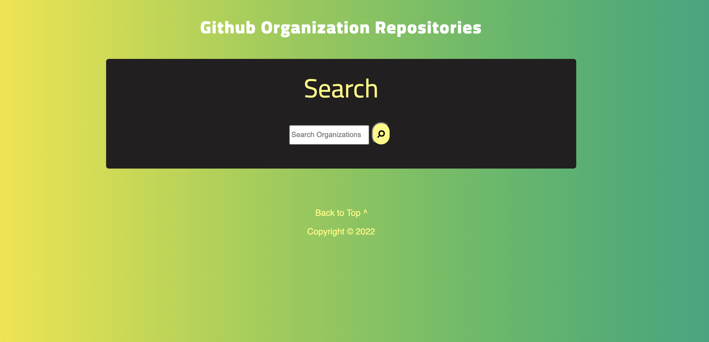
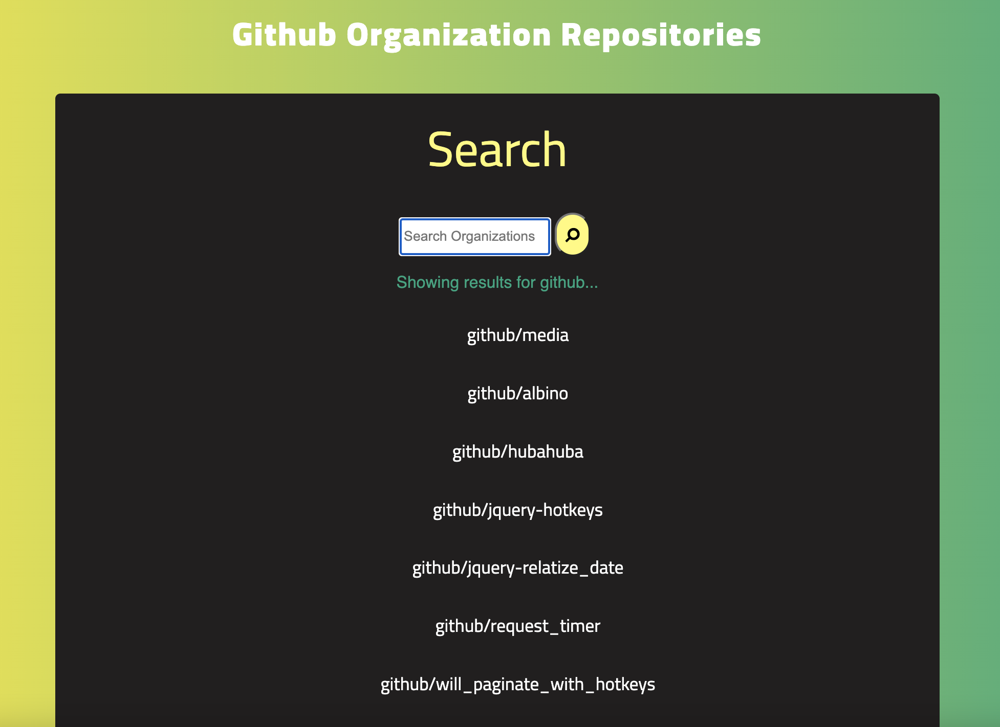
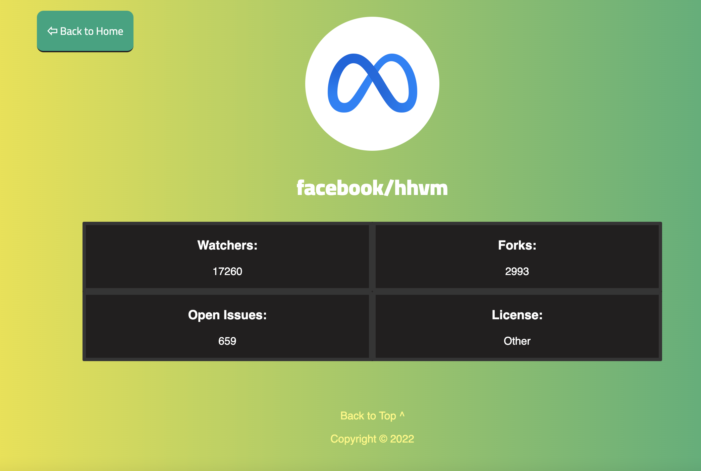

# Github-Organization-Search

The purpose of this application is to be able to search organizations, and look through their repositories, as well as get information on their repositories. This was difficult for me to complete, and as you can see, at the moment it is not complete. Some things I struggled with included mostly the API calls, because often I ran into the issue of react being too fast for the api to catch up, leading to undefined errors left and right. Being so new to react, this is definitely something I need to work on. I definitely think that I would approach this differently in the future if making a similar app, I would have started differently and built up the main content of the application first, and followed up by applying the main functions of the website. I am definitely better off having had this practice, I have learned a lot of react functionality that I did not have before working on this app, and I have confidence my knowledge will only grow from here.  

## Installation

In order to run this project, you need to first clone the repository to your local machine. Next, if you have node.js already installed, run npm i in your commandline. After you have all the dependencies installed, you can run npm start to start the application. 

## Usage
1.  Open the application on your local host 3000 in the browser: [LocalHost](http://localhost:3000/), and you should get a page that looks like this: 

    

2. After you open the main page, type in the search bar an organization that you would like to see their repositories for, and press the enter key, or press the button next to the search bar. 

    

3. This next feature is not working yet properly yet, but eventually, when you click on a repository name, it will direct you to a repository page, and show the following information for the repository you clicked on: 

    

    On this page, you can also click the title, and it will bring you to the repository on github. 

4. Once you are done on the repository page, you can click the button "Back to Home" and it will take you back to the home page, so that you can continue your searching. 

    

## Credits

- [react crash course](https://www.youtube.com/watch?v=w7ejDZ8SWv8)
- [react router dom v6 documentation](https://reactrouter.com/docs/en/v6/getting-started/overview)
- StackOverflow

## License

